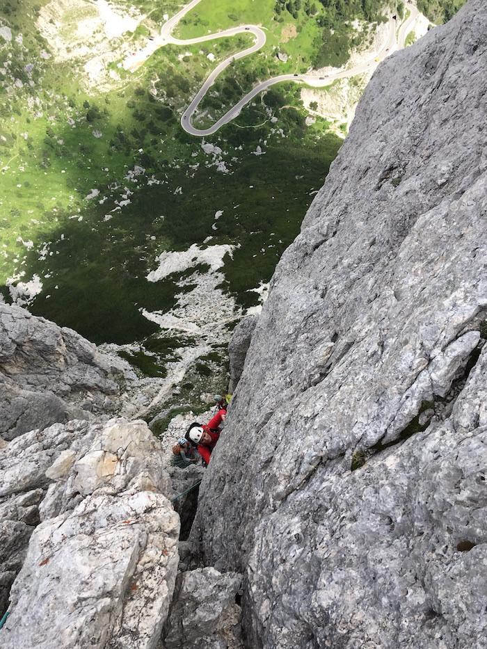

Hinter diesem Blog stecken wir - Yannick & Antonia. 
Heimat in München und aktuelles Zuhause im VW-Bus. Auf rotpunktreisen.de dokumentieren wir die Klettergebiete, die wir während unserer Reisen durch Europa besuchen und die vielleicht auch anderen Kletterern uns gut gefallen könnten. 
Vielleicht verirrt sich zwischendurch noch der ein oder andere Artikel über schöne Wanderungen, Trekkingtouren oder Mountainbiketrails auf den Blog. Das machen wir nämlich ebenfalls gerne. 
Ciao!

