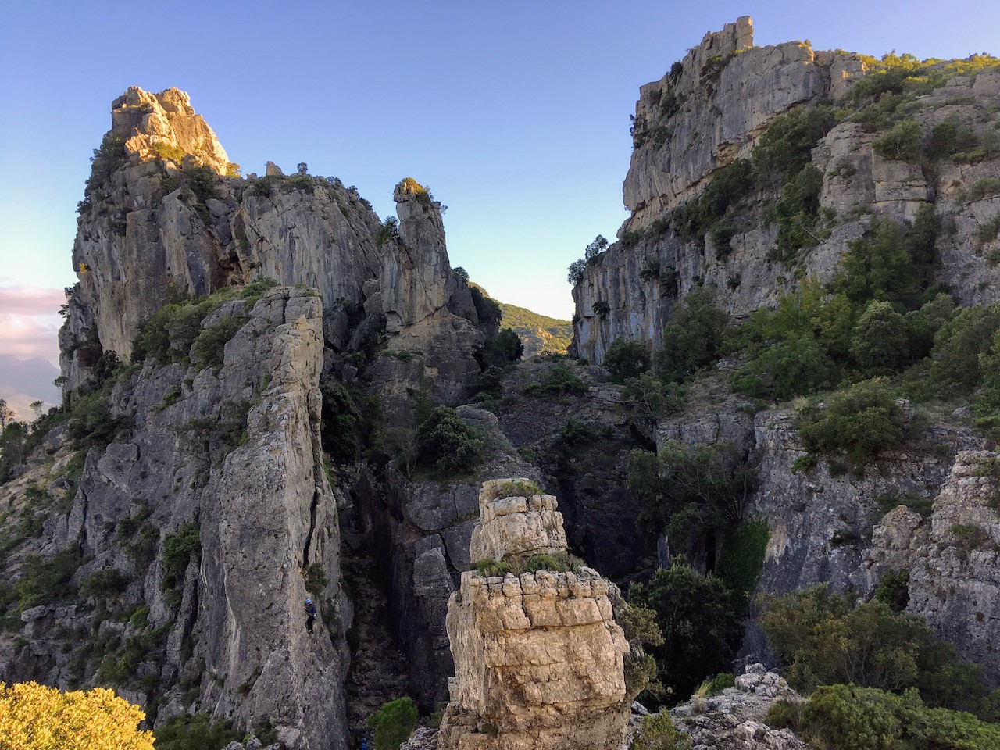

Manchmal sind es gerade die unfreiwilligen Planänderungen, die einen an das eigentliche Ziel einer Reise führen können. In unserem Fall war der Auslöser ein platter Autoreifen, der uns für einige Tage in einem Dorf mitten im sardischen Bergland festhielt - und uns rückblickend die schönsten Tage der Reise beschert hat. 

Ulassai - ein kleines Bergdorf, welches wahrscheinlich den wenigstens Sardinien-Urlaubern ein Begriff ist. Ulassai liegt im Herzen der Ogliastra und ist, wenn überhaupt, für seine Höhlen (Is Lianas und Su Marmuri) bekannt, die zu den größten Europas gehören.

Was wir bisher nicht wussten - die Kalksteinfelsen rund um das Dorf bieten Kletterern (Mountainbikern, Motorcrossfahrern und Highlinern…) einen fast unendlich großen Abenteuerspielplatz: 

`youtube: https://www.youtube.com/embed/62-Rrl5E6uA`

Uns das allen Dank der Nannai Climbing Family.

### Nanawho?

Nachdem ein paar Locals das Gebiet 2001 für sich entdeckt hatten, kam 2011 eine international zusammegewürfelte Gruppe von Kletter-Enthusiasten nach Ulassai, gründeten die Nannai Community - und blieben.
Heute, einige Jahre und viele Bolts später, haben sie in und um das Dorf herum ein wahres Kletterparadies erschaffen. In der Gegend um Ulassai und den Nachbar-Kommunen Jerzu und Osini finden sich unzählige abwechsungsreiche Gebiete in traumhafter Natur mit hunderten, top abgesichterten, Kletterrouten. 

Die Community betreibt im Dorf ein kleines Guesthouse, das [Nannai Climbing House](https://www.climbingulassai.com/), das neben der Unterkunft auch Kletterkurse und Yoga anbietet, ein [Kletterfestival](https://www.youtube.com/watch?v=PzZa-ZYVlus) organisiert und mit dem Event “Women Rock” ein Frauen-fokussiertes Kletterevent auf die Beine gestellt hat. 

### Klettern in Ulassai 

Drei Tage sind leider nicht mal ansatzweise genug Zeit um die Gegend zu erkundigen, deshalb haben wir bisher nur zwei der über 16 Spots in der Region kennengelernt: Su Casteddu und Canyon Sa Trappara.

Während wir bei Su Casteddu nur ca. 4 Routen geklettert sind, haben wir den Canyon um einiges intensiver erklettert und waren zwei volle Tage in diesem Gebiet.

**Su Casteddu** liegt ein paar Fahrminuten außerhalb des Dorfes, an einer der großen Steilwände, die Ulassai umgeben. Nach ca. 20 Minuten Zustieg erreicht man ein Plateau mit bereits atemberaubender Aussicht über das Tal. Der Sektor zieht sich nun über einige hundert Meter am Wandfuß (Achtung, nix für Kinder - nur für Ziegen) entlang und bietet 65 zum Teil plattige- zum Teil überhängende Routen vorrangig in den Graden 6 und 7.

Mein Favorit war eine 38m lange, eher einfache 6a Route (Un Have Maria), die sehr dazu verleitet, mehr Aufmerksamkeit der Aussicht im Rücken, als auf den Fels vor sich zu schenken.

Der Canyon **Sa Trappara** kann sogar zu Fuß direkt aus dem Dorf erreicht werden und ist nur wenige Meter vom Nannai Climbing Home entfernt. Der lange, meist schattige Canyon ist besonders für warme Tage empfehlenswert und bietet in 16 Sektoren über 150 Routen, die wirklich keine Wünsche offen lassen. Von Anfängerrouten (10x4er, 23x5er,47x6er) bis zu schweren Routen (45x7er 14x8er) ist alles dabei und sogar die einfacheren Routen sind schön vertikal und griffig. Bei den Routen in den oberen Sektoren (Sektor 15 & 16) hat mein einen traumhaften Blick über das Tal und kann die Abendsonne genießen.

Yannicks Favorit war eine 6c Route namens Tossica, die sich kleingriffig 30m gleichbleibend schwer die Wand hinauf zieht.

### Und sonst?

### Stay local!
Nach einem langen Klettertag gibt es dann nichts besseres, als ein Ichnusa Limone und eine große Pizza in der lokalen [Pizzeria Gian Battista](https://goo.gl/maps/N8VRZezDt9smGfKR7). 
Jeden Dienstag gibt es einen kleinen Markt auf der Piazza Barigau, auf dem man sich mit lokalen Produkten versorgen kann. Abgesehen davon gibt es zwei kleine Supermärkte im Dorf. Unser Tag hat meistens mit einem super Cappucchino und einem Brioche (con crema) auf der Terasse der [Bar & Paninoteca Stazione Curcuda](https://goo.gl/maps/cyKt7YDFnMSmcL2z7) begonnen um gemütlich die Spots und Routen zu planen.

Die Gegend ist außerdem für ihre Cannonau-Weine aus der Valle del Pardu bekannt, die man bei vielen lokalen Händlern verkosten und natürlich kaufen kann. 

### Ausrüstung
Für die meisten Sports reicht ein 60/70m Seil, wir waren allerdings doch ganz froh, bei Su Casteddu unser 80m Seil eingepackt zu haben - sonst wären wir leider nicht in den Genuss einer schönen 38m Route gekommen.

Ansonsten ca. 15 Expressen und natürlich Material zum Umbauen, in den meisten Routen findet man am Top einen doppelt-gesichterten Ring
(Für die Mehrseillängen gelten natürlich andere “Packlisten”)

### Kletterführer
Den lokalen Kletterführer von der Nannai Crew kann u.a. an der Bar & Paninoteca Stazione Curcuda, sowie in mehreren Bars und Shops oder im Climbing House für ca. 15€ gekauft werden. Der Guide ist super ausführlich, liebevoll gestaltet und hat uns bestens durch die Tage navigiert. Neben den Spots und Sektoren findet man auch Infos zum Ort, Übernachtungsmöglichkeiten sowie weitere Sportoptionen wie Highlining, Mountainbiking und Trekking. Go and get it - denn mit einem Kauf leistet ihr euren Beitrag zur Community!

[Ulassai Guidebook](https://www.climbingulassai.com/guidebook-2/)

### Reisezeit
Klettertouren sind vom beginnenden Frühjahr bis in den späteren Herbst hinein möglich (und laut locals auch im Winter…). Wir waren Anfang Oktober in Ulassai und das Wetter war perfekt - nicht mehr allzu heiß, aber sehr sonnig und im Canyon angenehm kühl.

### Übernachten
Da wir mit dem VW-Bus unterwegs waren, können wir an dieser Stelle nur unseren wunderbaren Standplatz inklusive sehr nettem Streunerhund (s.Foto) verraten (39°45'39.3"N 9°30'22.3"E). Neben dem Nannai Climbing Home werden im Guide aber auch noch andere B&Bs und Hotels genannt. Einen Campingplatz gibt es in der unmittelbaren Umgebung allerdings scheinbar keinen.

### Restday?
Wandern, Mountainbiken oder ein Abstecher an´s Meer! Hier können wir den langen Sandstrand “Spiaggia di Cea” empfehlen, der ca. 40 Autominuten von Ulassai entfernt liegt und den wir zufällig entdeckt haben. Bestimmt haben die Locals aber noch bessere Gemeintipps...
Ansonsten gibt es ein lokales Freilichtmuseum, das Gegenwartskunst aus den Bereichen Architektur, Natur und Kunsthandwerk zeigt, sowie das neue Museum für Zeigenössische Kunst, die Stazione dell'Arte, mit u.a. Werken der Objekt-Künstlerin und Malerin Maria Lai.

**Ulassai, wir kommen wieder!**
