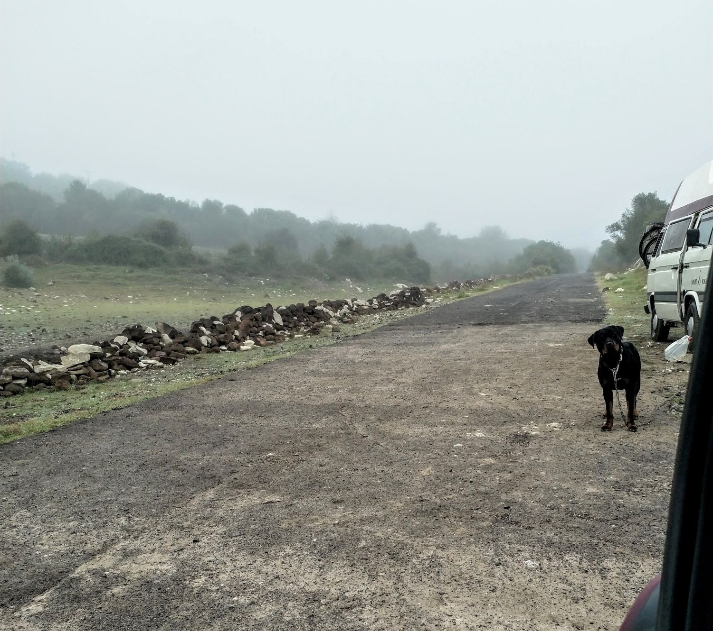
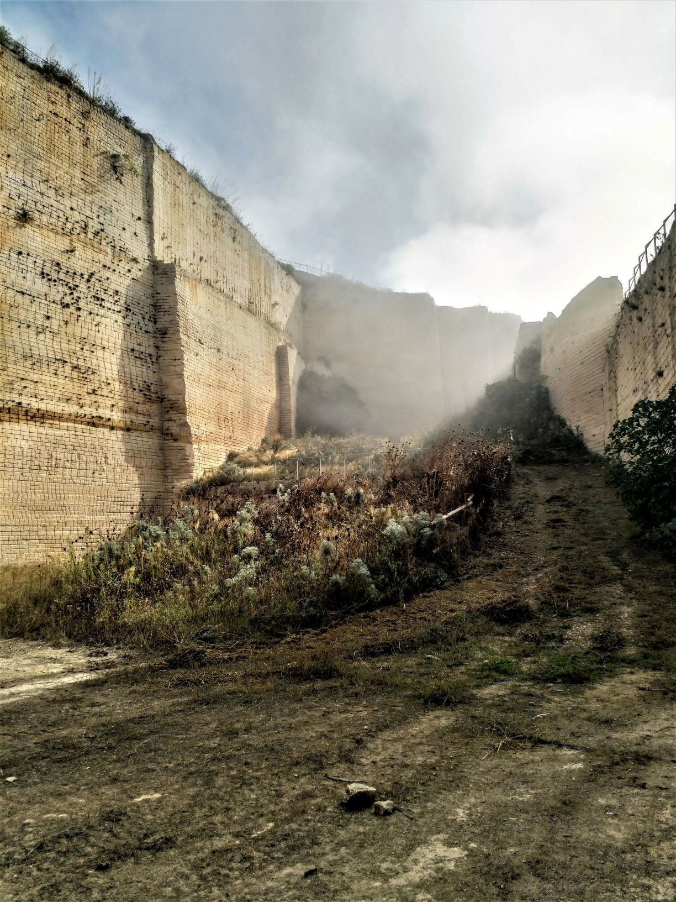
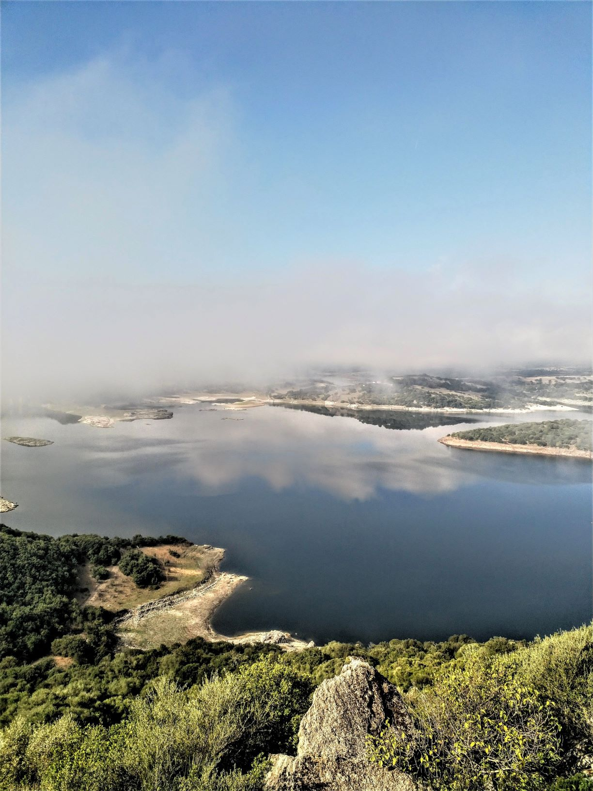
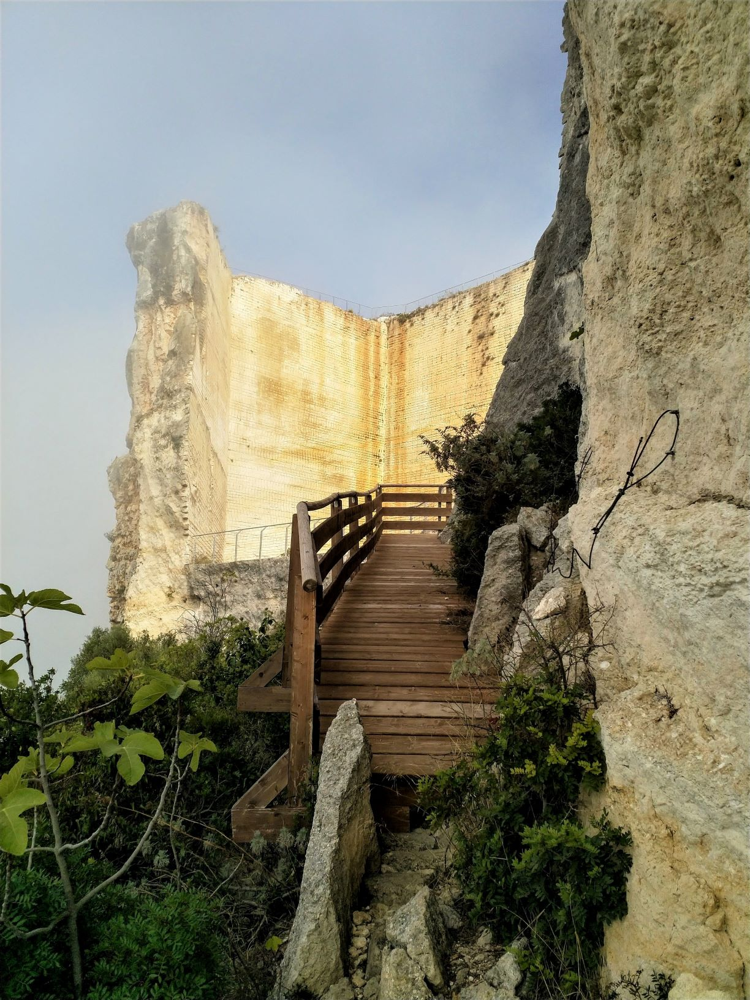
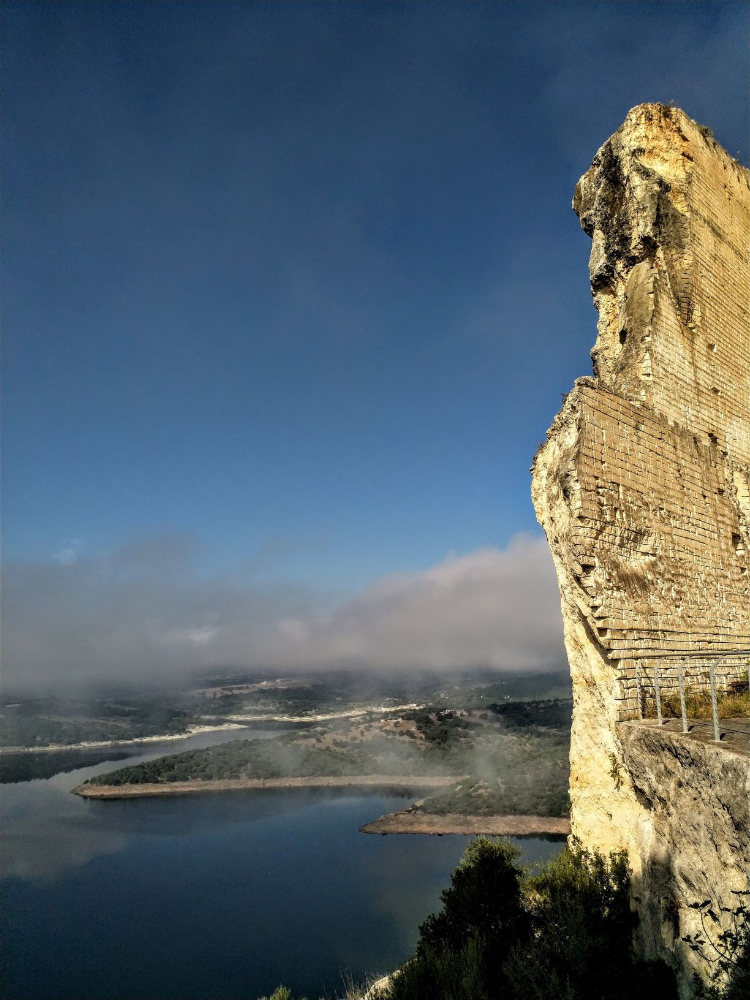
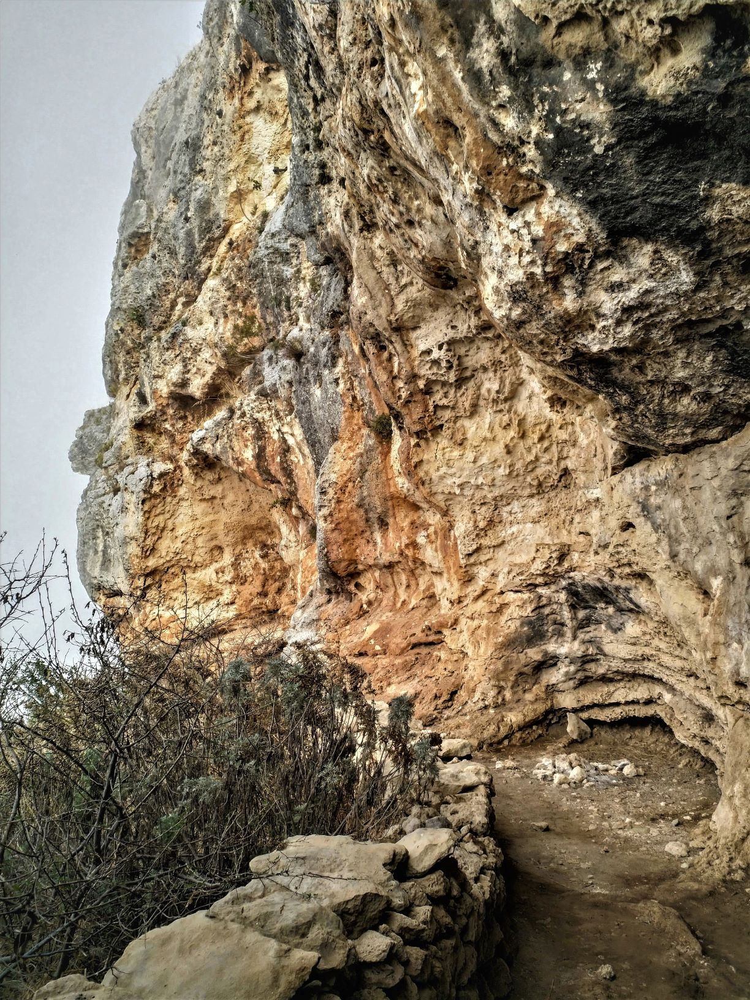
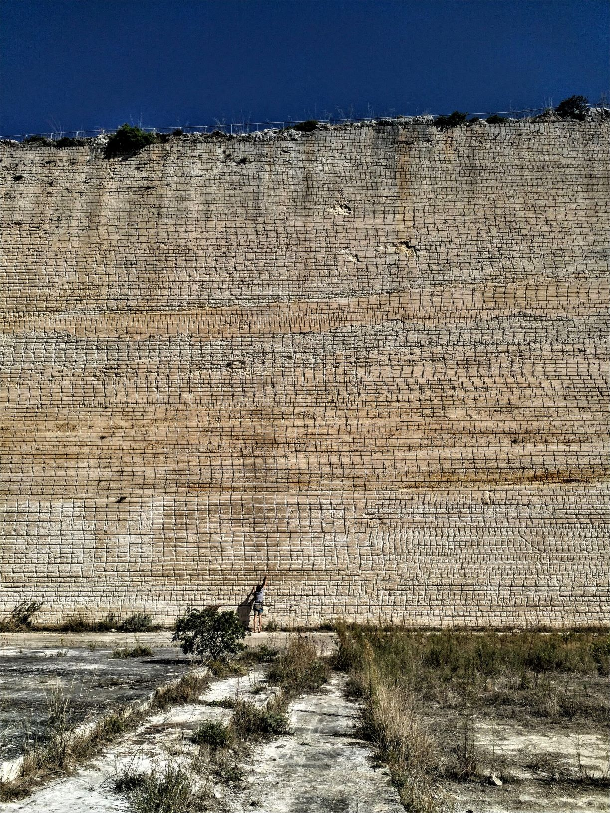
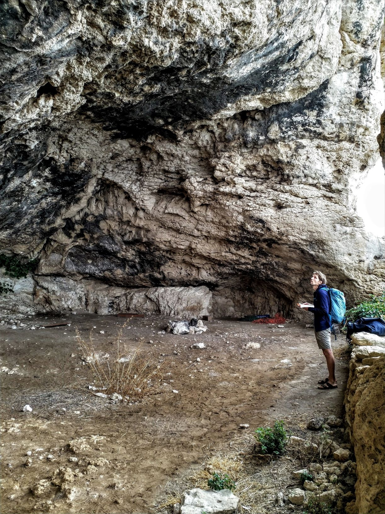
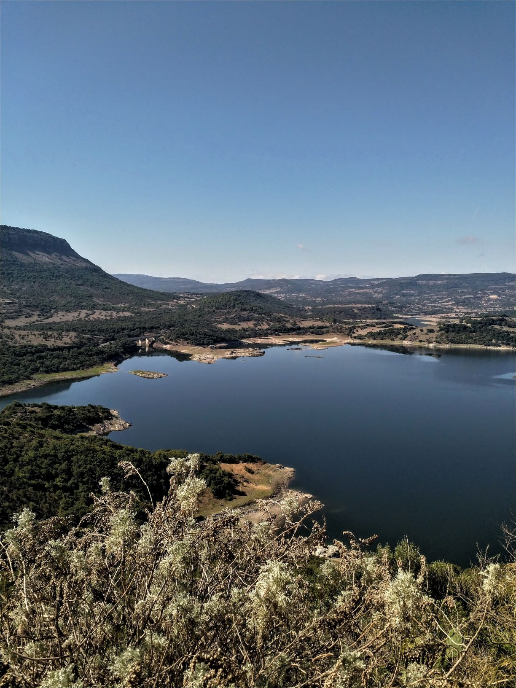

Wenn ein Tag mit einem Blick in ein Rottweilergesicht anfängt und mit einem Bad in einem kalten, nebeligen See aufhört, klingt das im ersten Moment nicht nach einem Traumtag aus dem Bilderbuch. Warum uns dieser Tag in Roccadoria Monteleone aber trotzdem im Gedächtnis bleiben wird? Nunja, lest selbst...
 
Um zu unserem ersten Kletterspot zu gelangen, fahren wir zunächst einmal in's Landesinnere. Der Lago del Temo ist heute unser Ziel, an dem das auch das wohl atypischste Klettergebiet Sardinens liegt.  
Erst 2006 erschlossen, klettert man nun auf Tuffstein, der von einer mehr oder weniger festen Kalksteinkruste überzogen ist. Der Stein ist teilweise so brüchig, dass wir mehrmals ein paar unfreiwillige Souvenirs in den Händen halten.

Aber zunächst zurück zur Hundegeschichte... 
Auf der Suche nach einem Schlafplatz folgen wir gegen Abend einer kleinen Sackgasse Richtung Lago del Telmo, die uns direkt an das Seeufer führen soll. Da wir in dieser Ecke bisher nur sehr wenig Touristen begegnet sind, überrascht es uns umso mehr, als wir am Ende der Sackgasse eine alten T3 Bulli stehen sehen.
Noch ein paar Meter weitergefahren und es kommen laut bellend zwei Rottweiler hinten dem Bus hervor und kündigen unsere Ankunft an - beide ziehen an einer langen Eisenkette, die am Bus befestigt ist. Unschlüssige Blicke zwischen Yannick und mir.  FAST FORWARD   Wir sitzen mit dem Rentnerpaar W. und B. bei einem Kanister sardischen Rotwein zusammen und die zwei "Rottis" liegen friedlich schlafend unter dem Tisch. Wir leeren ein Glas nach dem anderen, unterhalten uns über Gott und die Welt und schauen gemeinsam in den klaren Sternenhimmel.

Trotzdem beginnt der nächste Tag früh und führt uns gleich im Morgennebel in das kleine Dorf Roccadoria. Ein alter Steinbruch ist das Ziel, der die Kulisse für ein [Klettergebiet der besonderen Art](https://goo.gl/maps/sU5eDi4ZzqugyRfx5/) bietet. Sobald man sich am Steinbruch befindet, ist das nahe Dorf vergessen und der Blick gilt erst einmal einige Minuten der schönen Aussicht auf den Lago del Temo, der sich direkt unterhalb im Tal befindet.
Die Atmosphäre und die Ästhetik der Routen entschädigt für den ein oder anderen brüchigen Abschnitt. 

Die Route Tetris (6b) führt direkt an der Steinbruchwand nach oben - kein klassisches “Fels-Erlebnis”, aber trotzdem sehr besonders. Eine leichte, aber trotzdem erwähnenswerte Route ist außerdem die Route Pericolante (5b), die sich direkt an der Bruchkante entlang zieht.

### Ausrüstung & Absicherung
Absicherung durch Klebehaken. Aufgrund des Steins sollen auch keine Bohrhaken verwendet werden. Achtung, die Griffe und Tritte können ziemlich brüchig sein - auch wir hatten einige lose Steine in der Hand….

### Kletterführer
Dieses Gebiet findet man im Standard-Kletterführer Pietra di Luna von Maurizio Oviglia. Wie immer ist neben der Topo auch sehr viel Information zur Entwicklung des Gebiets, der Erschließungsgeschichte sowie den einzelnen Sektoren zu lesen.

### Reisezeit
Ganzjährig, allerdings wird es im Sommer vor allem am Nachmittag richtig heiß (Sonne ab ca. 10 Uhr im rechten Sektor und am 14:00 Uhr im linken Sektor). Selbst bei uns im “Winter” wurden wir nachmittags ziemlich gegrillt…
Positiv ist, dass man in den meisten Sektoren auch bei leichtem Regen klettern könnte.

### Übernachten
Wir haben wir eine [kleine Sackgasse](https://goo.gl/maps/XiLRKxbJXctB42FX7/) gefunden, die direkt in den Lago del Temo zu münden scheint. Dort haben wir eine entspannte Nacht verbracht und konnten morgens direkt vom Bus in den See springen. 
Alternativ kann man auch in den zwei kleinen B&Bs im Dorf unterkommen oder etwas weiter zum [Agriturismo Mendulas](https://www.mendulas.it/) fahren, welcher im Kletterführer erwähnt wird.

### Restday?
Obwohl es eher unwahrscheinlich ist, dass man in diese Region fährt, wenn man einen Restday geplant hat, gibt es bestimmt die ein oder andere Aktivität abseits des Kletterns rund um Roccadoria. Wir haben außer Klettern, Baden und Wein trinken nicht viel gemacht... Das Dorf selbst ist unter der Woche eher ausgestorben und außer der Überresten des ehemaligen Castello di Monteleone gibt es wenig zu sehen. Vielleicht doch lieber Tetris ausprobieren...?

