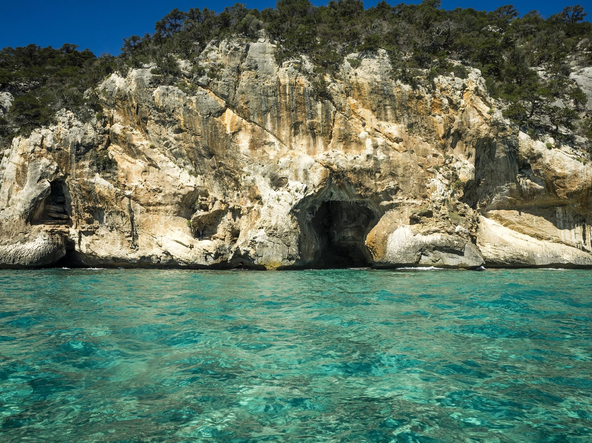
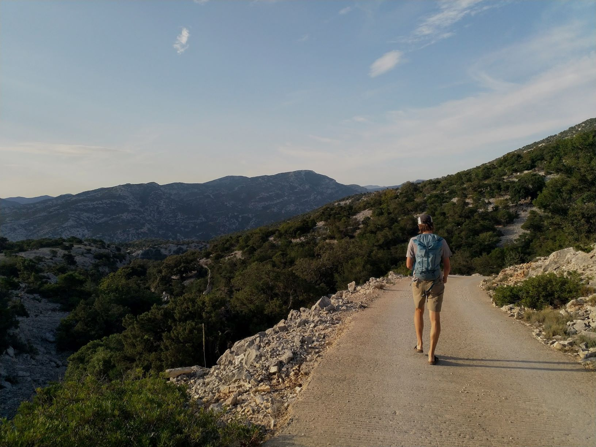
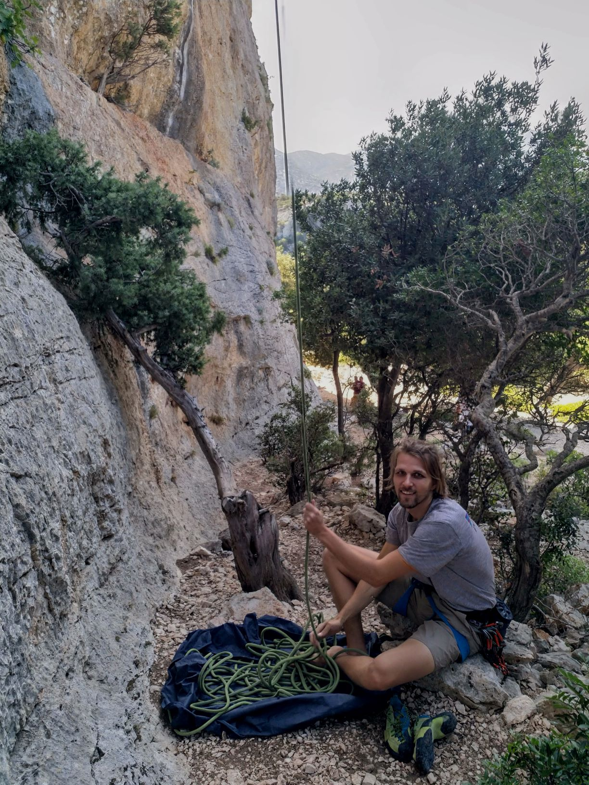
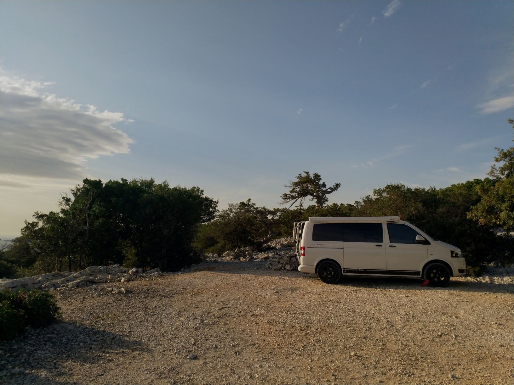

Die Gegend rund um **Cala Gonone am Golfo die Orosei** ist wohl eine der populärsten Kletterregionen auf Sardinien. Wo sonst auf der Insel lässt sich ein Strandurlaub mit zahlreichen Kletterausflügen so gut vereinen wie an diesem Fleckchen im Osten der Insel (Okay, vielleicht noch Cala Goloritze oder Pedra Longa bei Baunei...). Der Ort ist in Kletterkreisen mittlerweile weltbekannt und mit über 32 Sektoren findet sich für jeden Geschmack der passende Fels. 

### Ein Klettergarten zwischen Berg und Meer

Gegenverkehr! Gerade jetzt - gerade hier. Wir haben uns schon einige Serpentinen vorgearbeitet und vor jeder Kehre leise gehofft, dass uns kein anderes Auto hier entgegen kommt. Rechts von uns befindet sich der steinige Berghang und links fällt die Straße steil nach unten ab. Dazwischen unser VW-Bus, der gerade noch so auf die schmale Straße passt. Was jetzt kommt, ist Milimenterarbeit - Stück für Stück manövrieren wir den Bus rückwärts die kleine Straße hinunter. Locals haben nun mal Vorfahrt. War nicht etwas weiter Hinten eine kleine Ausweichstelle...? 

Die Anfahrt zum Klettergarten **Buchi Arta** ist zwar etwas mühsam, aber trotzdem bisher unser ungeschlagener Favorit in der Region um Cala Gonone. Griffiger Fels aus Kalkstein und viele schöne, lange Routen machen diesen Sektor zum absoluten Traumgebiet für eher leichtere und mittelschwere Klettereien (ca. 40 Routen im Bereich 5b bis 6c+). Überhänge findet man hier zwar nicht, dafür klettert man auch in den unteren Graden meist auf senkrechten Wänden sowie waagrechten Rissen. In der Nebensaison (in unserem Fall Oktober) liegt das Gebiet bis zum frühen Nachmittag angenehm im Schatten und zwischen den vielen Steineichen- und Olivenbäumen kann man entspannt eine Hängematte aufhängen. Aus diesem Grund ist dieser Sektor auch ein super Klettergebiet für Familien mit Kindern. Die Routen sind durchnummeriert, meist namenlos und zwischen 15m und 30m lang. Als kleinen Minuspunkt könnte man die verhältnismäßig langen Bohrhaken-Abstände nennen, die bei dem, doch teils sehr scharfem Fels, nicht gerade Mut machen... 

Während unseren Klettertagen im Gebiet haben wir uns aus purer Begeisterung eher dem reinen Klettern als dem Fotografieren gewidmet, weshalb es leider wenig Bildmaterial gibt.

### Weitere schöne Sektoren in der Nähe von Cala Gonone:
* Cala Luna
* Cala Goloritze
* Cala Fuili 
* Biddiriscottái
* Margheddie
* Budinetto
* La Poltrona
* S´atta ruja

### Und sonst?
Vor Ort gibt es den kleinen Klettershop [Stile Alpino](https://goo.gl/maps/bnU8cUd7xtGvWbQ1A), welcher auch eine weitere Zweigstelle in [Cagliari](https://goo.gl/maps/zF2xFi4gzwgzebhf7) betreibt.
  Direkt vor der Filiale in Cala Gonone findet ab und zu ein winziger Bauernmarkt statt, an dem man sich mit leckerem Obst & Gemüse versorgen kann. Nach genauen Zeiten erkundigt man sich am besten direkt im Kletterladen.

In Cala Gonone reiht sich ein Restaurant an das Nächste, die Auswahl reicht von kleines Bistros und Cafés im Ort bis hin zu den zahlreichen Fischrestaurants an der Strandpromenade. Empfehlen können wir die Pizzeria [Pizzeria Zio Pedrillo](https://g.page/pizzeriaziopedrillo?share), die direkt gegenüber des Klettershops liegt.

Ebenfalls nur ein paar Meter entfernt, liegt die kleine Bar [La Pineta](https://goo.gl/maps/YQDgyZaWgXzUSW619), die im Kletterführer von Cala Gonone als Szenetreff der Kletterer genannt wird. Man kann sich dort in einem Buch verewigen oder durch die Geschichten anderer Kletterer blättern, sowie Updates zu den Routen in der Region finden.

### Kletterführer
Die meisten Gebiete in der Region findet man im Kletterführer [Pietra di Luna - Sportkletterführer Sardinien von Maurizio Oviglia](https://www.freytagberndt.com/produkt/9788889661314-oviglia-maurizio-pietra-di-luna-sportklettern-deutsch/). Wie immer ist neben der Topo auch sehr viel Information zur Entwicklung des Gebiets, der Erschließungsgeschichte sowie den einzelnen Sektoren zu lesen. Detailliertere Beschreibungen und Topos dieser und weiterer Gebiete findet man zudem auch in den vor Ort erhältlichen Mini-Führern. 

### Anfahrt & Übernachten

Die Straße zum Klettergebiet Buchi Arta ist, wie bereits beschrieben, ziemlich abenteuerlich und mit Wohnmobilen etc. absolut unmöglich. Selbst bei Tageslicht stellt Gegenverkehr auf der, zu einer Seite steil abfallenden Serpentinenstraße eine ziemliche Herausforderung dar. Daher merkt man sich am besten direkt bei der Fahrt mögliche Rangier-Abschnitte, falls man ausweichen muss. 

Mit einem kleinen Bus oder Camper kann man, wie wir es gemacht haben, direkt oben auf dem Pass ([Koordinaten](https://goo.gl/maps/gUULgSqJrD9uvaQu8)) übernachten. Wir waren meist alleine am Stellplatz und, abgesehen von ein paar vorbeifahrenden Bauern, absolut ungestört. Zudem hat man bei gutem Wetter einen traumhaften Blick auf das Meer und den Sternenhimmel. Vorsicht allerdings bei starkem Wind - der Stellplatz befindet sich direkt auf dem Bergsattel und wir wurden in einer Nacht nahezu weggeweht!

Uns wurde zudem der [Agriturismo Codula Fuili](https://goo.gl/maps/y32nsXTo3hFYamDFA) empfohlen, bei den man direkt bei der Anfahrt zum Klettergebiet vorbeikommt.
Wer es zentraler mag, kann auch direkt im Ort Cala Gonone auf dem [Campingplatz](https://www.calagononecamping.com/de/) übernachten. Hier steht man entspannt zwischen großen Pinien und kann von dort aus teilweise zu Fuß zu einigen der Klettergebiete wandern. An einem besonders windigen Tag haben auch wir hier eine ruhige Nacht verbracht.

### Restday?

Der Spot Cala Luna bzw. die gleichnamige Badebucht ist auch über eine kurze Wanderung (ca. 2 - 2,5 Stunden) zu erreichen, die direkt von Cala Fuili oder von Cala Gonone aus gestartet werden kann. Der Wanderweg führt durch mehrere Schluchten und Täler und bietet teilweise sehr schöne Aussichten auf die Wälder und das Meer. Leider wird Cala Luna auch mehrmals täglich von Lininenbooten angefahren, welche nach und nach Touristenladung über Touristenladung am weißen Bilderbuch-Sandstrand abladen, weshalb wir das Gebiet relativ schnell wieder verlassen haben. Bei nicht ganz so gutem Badewetter, hat man dafür die Bucht vielleicht ganz für sich alleine...
