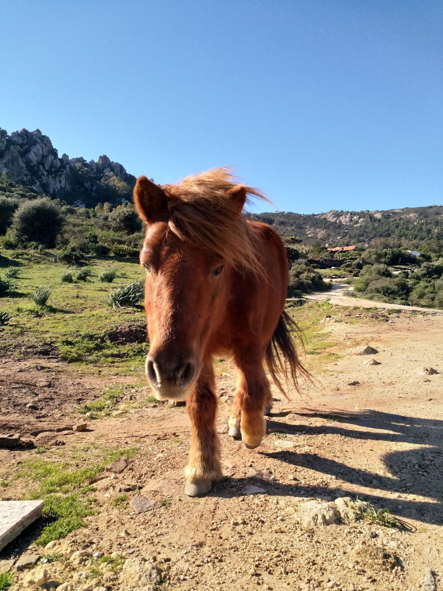
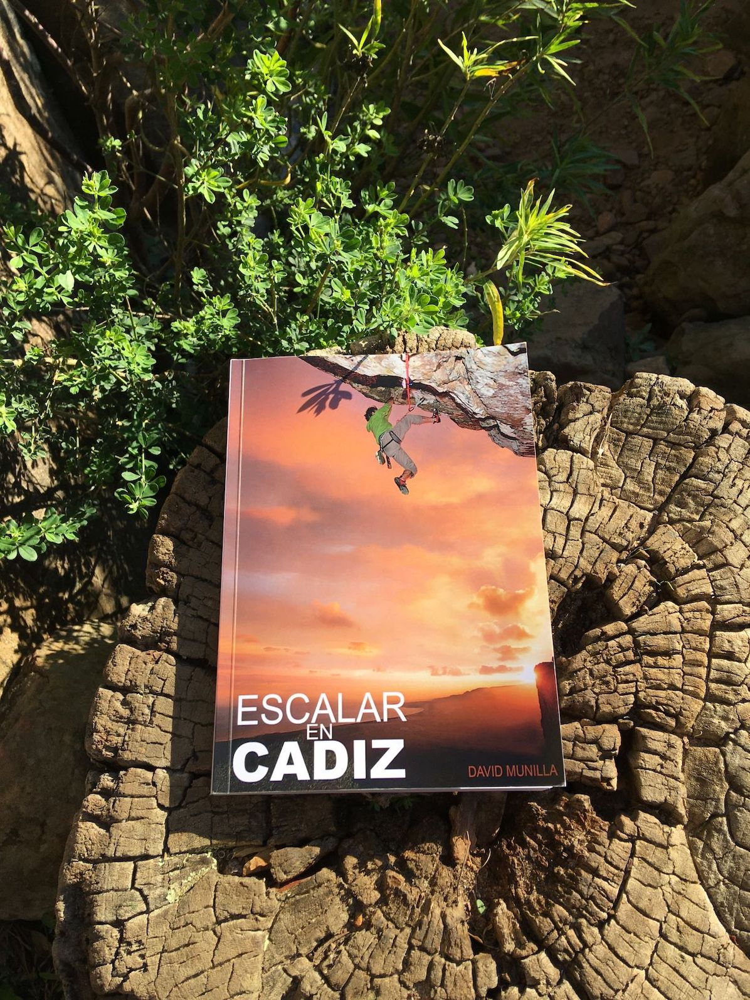

Die Gegend um Tarifa ist eigentlich eher als Wind-und Kitesurfgebiet bekannt. Die kilometerlangen Sandstrände bieten beste Konditionen und super Klima rund um´s Jahr und die Region ist deshalb vor allem in den Wintermonaten sehr beliebt. So viele Vans und Wohnmobile haben wir selten an einem Ort gesehen…
Ein paar Kilometer vom Meer entfernt, befindet sich aber auch das große Klettergebiet **San Bartolo**, welches im Nationalpark “Parque Natural del Estrecho” liegt und das wir nach unserer langen Fahrt nach Spanien als erstes besucht haben. 
 
Aufgrund seiner Lage zwischen Tarifa und Bolonia ist es wohl das [südlichste Klettergebiet auf dem europäischen Festland](https://goo.gl/maps/4UkUHLpYzg17eQqt8/) und man klettert mit Blick auf die Küste Marokkos.

Das Klettergebiet ist in zwei grobe Bereiche unterteilt, die etwas ältere **Zona Arriba** mit einigen klassischen Routen, sowie **El Tajo del Búho o Canuto del Arca** mit dem beliebten und ungewöhnlichen Sektor Mosaico. Der Fels ist noch von guter Qualität und besteht aus kompaktem Sand- und Kalkstein. Wir waren ausschließlich am unteren Sektor unterwegs, werden uns den oberen Teil aber bei unserem nächsten Besuch genauer ansehen.
 
El Tajo del Búho erreicht man über einen kleinen Weg durch die Siedlung und dann ca. 10 Minuten Fußweg bergauf in Richtung der Felswand des Berges San Bartolo. Vom Dorf kommend ist der Einstieg in den Wanderpfad ausgeschildert. 
 
Vor allem an Wochenenden und Feiertagen sind die unteren Sektoren auch bei Familien mit Kindern beliebt, die am Fuß der Felswand picknicken, d.h. wer Ruhe sucht, kommt besser unter der Woche oder früh am Morgen bzw. spät am Abend.
 
Mit über 200 Routen in allen Schwierigkeitsgraden ist das Gebiet sehr abwechslungsreich und reicht von leichten und kurzen Aufwärmrouten bis hin zu schweren Platten- und Überhangsklettereien. 
 
Wir sind vor allem an den Sektoren Los Bordillos und Mosaico geklettert. In Los Bordillos findet man vor allem eher kürzere und leichtere bis mittelschwere Routen, d.h. viele 4er, 5er und 6er.
 
 
Die Hauptwand im Sektor Mosaico startet mit ein paar 5er Routen und bewegt sich dann vor allem im 6er und 7er Bereich. Die Felsstruktur ist wirklich ungewöhnlich, meist sehr steil, griffig und sehr schön zu klettern.

Besonders beeindruckend waren die vielen riesigen Gänsegeier, die in den Felsen weiter oberhalb nisten und welche manchmal während der Kletterei am Fels kurz über den Köpfen vorbeifliegen. Wegen der Brutzeit dieser lokalen Vogelkolonien ist das Klettern an diesen Felsen auch in der Zeit von Anfang März bis Ende August verboten.

Wenn man sich ordentlich verhält, kann man ohne Probleme auf dem Parkplatz der kleinen Siedlung Betis stehen bzw. übernachten und mit etwas Glück wird man morgens von ein paar neugierigen Ponys geweckt, die Ihren Kopf in den Van stecken und ihren Anteil vom Frühstück fordern.
Ab und zu kommen auch ein paar Ziegen, Mulis, Pferde oder Hunde vorbei, d.h. der Ort fühlt sich eher wie ein Farmstay an als ein gewöhnlicher Dorfparkplatz.

### Ausrüstung & Absicherung

Die meisten Routen sind mit Klebe-oder Borhaken abgesichert, je nach Sektor gibt es aber auch ein paar cleane Routen, in denen man sich selbst sichern müsste (Sektor Glacas Grandes, Mehrseillängen bis zu 75m). Die Länge der Routen in den unteren Sektoren liegt zwischen 10-20 Metern.

Wer ohne Seil unterwegs ist, findet in dem Gebiet auch einige Boulder, Crashpads dafür können ggf. in Tarifa ausgeliehen werden. Am besten man fragt z.B. mal im Outdoorshop & Tourenanbieter [Girasol Outdoor Company](http://http://www.girasol-adventure.com/) nach.

### Kletterführer

 

Wir haben den spanischen Guide “Escalar en Cadiz” von 2018 verwendet, der das Gebiet sehr ausführlich anhand von Fotos beschreibt. Es gibt wohl noch ein paar andere Guides, aber da unser Buch mehrmals von anderen Klettern ausgeliehen wurde, scheint er etwas übersichtlicher zu sein als andere Guidebooks.

### Reisezeit

Theoretisch ganzjährig, aber da man sich an die Brutzeiten der Vögel an den unteren Sektoren halten sollte, eher im Herbst und Winter von Anfang September bis Ende Februar. Da die unteren Sektoren in der Sonne liegen wäre es im Sommer allerdings sowieso zu heiß. Um Regen muss man sich eher weniger Sorgen machen, die Region gehört mit ca. 300 Sonnentagen zu den sonnenreichsten Regionen Europas.

 

### Übernachten 

An den zwei lokalen Parkplätzen kann unserer Erfahrung nach problemlos übernachtet werden, so lange man sich unauffällig und ruhig verhält. Die Bauern kommen immer mal wieder an den Plätzen vorbei um in den Bergen nach dem Vieh zu sehen und wir haben uns ab und zu kurz unterhalten. 

 

Die meisten Häuser in der Siedlung sind allerdings Ferienhäuser die gemietet werden können. 
Wer den Kletterurlaub mit Yoga oder Reiten kombinieren möchte, kann sich bei dem Familienbetrieb [Aventuras del Sur](http://aventurasdelsur.com/de/start/) einmieten, die eine der schönen Fincas in der Siedlung Betis besitzen.
Richtung Tarifa gibt es natürlich unzählige weitere Unterkünfte, Hostels und Campingplätze.

Mit Frischwasser kann man sich an einem Wohnmobilparkplatz im Nachbarort Facinas versorgen und eine Stranddusche findet man am schönen Strand von Bolonia, an dem man in der Nebensaison ebenfalls übernachten kann. Kleine Lebensmittelläden findet man ebenfalls in Bolonia, für größere Einkäufe fährt man besser nach Tarifa. 

Besonders empfehlen können wir das kleine vegetarische Restaurant [Chilimosa](https://www.chilimosa.com/) in Tarifa ♥ 

### Restday?

Die Möglichkeiten sind endlos! Neben Reiten, Yoga, Schwimmen, Surfen und Wandern kann man in der Gegend auch Mountainbiken. Wir hatten uns eine Tour über Outdooractive ausgesucht, die etwas abenteuerlich geworden ist und wir die Räder mehrmals durch Sand, Gestrüpp und Felsen tragen mussten. Aber wer ein bisschen mehr recherchiert, findet bestimmt super Touren.
